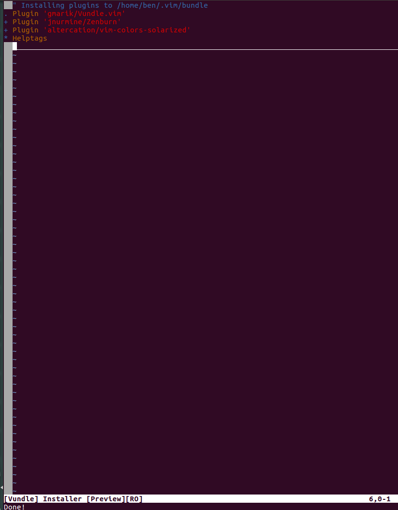
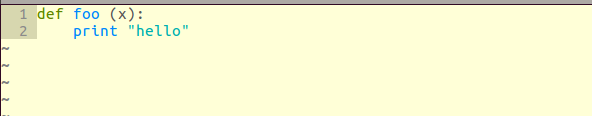
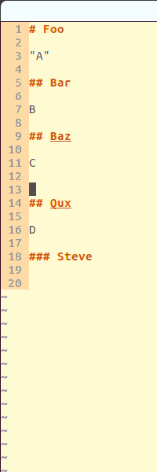
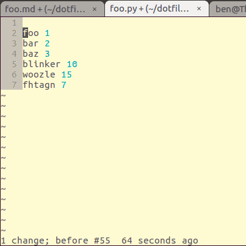

# From Zero to Markdown

We're going to start from nothing and go to using Vim as a reasonable Markdown editor.  In my experience, it is easiest to get used to Vim by getting to a tool I would actually use, and gluing new features to my workflow as I need them.  This will take about an hour.

We're actually covering a big chunk of material:

1. Basic usage
2. Safe config
3. Remappings
4. Plugins
5. Making a good Markdown editor
6. Learning gestures

Don't get discouraged, and take breaks as needed.  This document is self-contained and doesn't rely on subsequent material to teach you something useful; you are making real progress that matters.  If you play around with the final product for a while, you will begin to understand what it feels like to actually use vim.

## Aside: Sources

I am primarily cribbing from this [excellent guide](https://realpython.com/blog/python/vim-and-python-a-match-made-in-heaven/), along with these posts: [1](https://sanctum.geek.nz/arabesque/vim-anti-patterns/), [2](https://sanctum.geek.nz/arabesque/vim-misconceptions/), [3](https://sanctum.geek.nz/arabesque/vim-annoyances/), [4](http://stackoverflow.com/questions/5400806/what-are-the-most-used-vim-commands-keypresses) and [Gary's dotfiles](https://github.com/garybernhardt/dotfiles/blob/master/.vimrc).  However, this presentation more closely matches my journey in growing to appreciate Vim.

## The hello-world of vim.

Here are the most basic of basics of Vim.

1. Open a file with `vim {filepath}`, ex `vim ~/foo.md`.
2. Whenever you want to type anything, hit `esc` `i` `{things you actually want to type.}` Move around with arrow keys.
3. When you want to save, hit `esc` `:w` `enter`.
4. Exit with `esc` `:q` `enter`, or save and quit with `esc` `:wq` `enter`.

Do the above with "{things you want to type}" = "Hello world", and you have the hello-world of vim.

I know that was super boring, but there are two points to it.  First, you just transformed a previously-mysterious/notoriously-obtuse command-line tool into Notepad.  That's a big step, which will form the basis of every subsequent upgrade, and it was super painless!  Second, it demonstrated a very important point: Vim does not need to be intrinsically scary and full of nonsense.

Let's briefly go over what those incantations were actually doing.

## Modal editing

Vim has several different modes, but only three of them are really useful: command/normal mode, insert mode, and visual mode.  You can pretend the other modes don't exist.

Command mode is the home base of vim.  You don't get lost in different modes because the default is to be in command/normal mode, and only jaunt into visual/insert for short periods.  `esc` takes you to command/normal mode; it prefixes the incantations above so I could get you to switch modes without knowing what modes are.

Insert mode is the actual "I want to type into this document" mode.  It is accessed from command mode via `i`.  (Thus `esc i` above was my way of getting you to command mode, then to insert mode, regardless of wherever you were.)

Visual mode is not necessary for now, but will definitely come up later.

The commands for save (`:w`) and quit (`:q`) only work in command mode (otherwise, you might be inserting them).  They have colons for [legacy reasons](http://stackoverflow.com/questions/14051712/why-some-commands-in-vim-require-a-colon-while-some-dont).  (Legacy reasons are the major source of crufty/bizarre things in Vim.  We'll squash the problems that matter as we need to.)  There are non-colon analogues later.

### TL;DR:

Stay in command mode (`esc`).  Edit with `i` then text.  Save and quit with `:wq`.

# Progress Check

We've turned vim into Notepad with opening, closing, and editing.  Let's make notepad-vim better.

# Intro ~/.vimrc

Vim is extremely configurable, and your place to do that is `.vimrc`.  It is usually in your home directory (`cd ~`); if you can't find it, look up online where it would live on your OS.

If you open your ~/.vimrc with Vim (`vim ~/.vimrc`), you'll notice there are no line numberings.  Insert (`i`) `set nu`, then go back to command mode (`esc`).  Save and quit (`:wq`), and reopen your .vimrc (`vim ~/.vimrc`).

Boom, line numberings.  Your first customization to vim is done, but we are going to do a ton more this session after we make some things safe.

# A safe, sane setup

Vim's configuration is plaintext, important, changes frequently, and is often experimentally changed.  Sounds like a version control problem!  So before we go skydiving, lets ensure that our parachute and backup are well-configured.  We're going to use git<sup>[1]</sup> and symlinks to backup our vim config and allow branching.

## Backup + VC ~/.vimrc

Make a ~/dotfiles dir and symlink per [here](https://github.com/bwarren2/dotfiles).  You want to go from
```
├── <First thing in dir>
...
├── .vimrc
...
└── <Last thing in dir>
```

to

```
├── <First thing in dir>
...
├── dotfiles
...
├── .vimrc -> dotfiles/vimrc
└── <Last thing in dir>
```

On linux, use `tree ~ -a -L 1` to get these views (`apt-get install tree` if you don't have it).  Git-ify your ~/dotfiles, and you have the first big safety check in place.

## Basic Config

In your ~/dotfiles/vimrc, make your vimrc look like [this one](https://github.com/bwarren2/dotfiles/blob/v0.1/vimrc).  Pasting with your preferred editor is fine for now.  Don't worry about the nature of vimscript yet; just know that things that look like comments are comments.

## A big remapping

I strongly recommend you remap your capslock key, preferably to `control`.<sup>[2]</sup> .  This works best at the system level.  Honestly, capslock is most useful for expressing rage in text; making that a little harder is a good life choice.  Guidance in the footnote.<sup>[3]</sup>

# Progress Check

You don't know it yet, but we've eliminated several big sources of error.  Our config changes:

 * fix the clipboard,
 * remove a dead-end of learning via the arrow keys
 * avert the disaster that is Caps lock.

Now in order to get around, use `h` `j` `k` `l` in place of `←` `↓` `↑` `→` .

There is just a little more setup before we get to our markdown sandbox: managing plugins.

## Plugins

Add [this block](https://github.com/bwarren2/dotfiles/commit/7547dce326be4871c5e951de2b21b3c645f2e08d) to your vimrc.  This sets up Vundle, which is aa plugin manager.  It makes installing and removing packages much cleaner.  It exposes a few controls for command mode, the most important being `:PluginInstall`.  Whenever you add plugins to your vimrc, remember to run `:PluginInstall` in command mode to actually install them.  Do that now to install Vundle itself, then quit out (`:q`).

## Colors

As a demo plugin to make sure you have everything working correctly, let's change the default color scheme.  Add [these lines](https://github.com/bwarren2/dotfiles/commit/24d8f9d1e06749363b5693e30b02945e55ee16d2) in the same places, (or just paste the entire config into your config,) then install the plugins (`:PluginInstall` in command mode).  You should see an image like this: .

Restart vim (`:q` all the way out and `vim`), and your colors should be different like so: .

By default, vim will try to syntax highlight based on file name.  To get the full effect, make a .py file (`vim foo.py`) and write some basic python.  If it looks like this, you did it!

## Markdown Support

Let's add better markdown support.  Add [these lines](https://github.com/bwarren2/dotfiles/commit/0bcc2a73c23be5f77eac4395a743bac5eac6d558) to your vimrc, install the plugins, and restart.  If you create a markdown file (`vim foo.md`) and start typing, you should now have spelling/grammar checking and some header highlighting.  Additionally, you can skip between headers; `[[` and `]]` in command mode jump between headers, as in this gif:



To fold or unfold particular sections, you can use `zc` (close) or `zo` (open).  Folding is a feature for later we will probably remap; see that it is neat, but probably ignore it.

## Learning New Gestures

We've finally set Vim up to be useful for a task I usually use Sublime for.  Here's the meat of why to vim: useful gestures.

You're supposed to spend most of your time in command mode, and very little time in insert mode.  Command mode offers more powerful tools for everything, including getting around.

Use Vim to write some Markdown (maybe "how you feel about this process", with beginning, middle, and end sections?).  Navigate in command mode, only use insert for adding text.  Whenever you find yourself hitting any key, ex h/j/k/l, more than a couple of times, try a new gesture that does what you actually want.  You'll probably work your way through this list:

### The most important commands:
`u` : undo
`ctrl+r` : redo

### Speed up movement

`w`/`W` : advance to the next start of word

`e`/`E` : advance to the next end of word

`b`/`B` : go back to the previous start of word

Not bad.  Definitely better than mashing keys.  But what about bigger ranges?

### More speed

`{` : go back one paragraph block

`}` : go forward one paragraph block

`0` : go to start of line

`$` : go to end of line

`^` : go to first non-whitespace

### Move + insert

Usually once you go somewhere, you want to edit.  Some gestures move and then drop you into insert.

`a` : go ahead one space and start insert mode

`A` : go to the end of the line and start insert mode

`o` : open a line in insert mode below where you are

`O` : open a line in insert mode above where you are

### Searching

`/text` : search forward for "text".  Advance through the list with `n`, back with `N`.  Use `?text` to search backward.  By default, both wrap .

### Delete, cut, and paste

Vim doesn't actually have delete, only cut.  You get used to it.

`dd` : cut line

`yy` : copy line

`p` : paste below

`P` : paste above

### Useful, looks weird

`.` : repeat last non-move command, ex "cut line".

**Remember: find the need for a thing in your workflow, then look it up and start using it.  This promotes feelings of accomplishment, because you have a problem, then solve it.**

## Composable gestures

Here is where things become unlike any other editor: almost every gesture in Vim is composable.  Numbers will do the command multiple times, ex `9k` is "go up 9 times". If you want to cut a word, `dw`.  Cut 15 of them: `d15w`.

### Macros

Do you have a particular sequence of commands you want to repeat?  `.` repeats an action, but what about reformatting some text a non-coder gave you using the same transform?  Enter macros:



This is a toy example, but observe: I copy a complex transform, then just apply it to all the lines.  In particular:

`qw` (starts recording a macro to the `w` location, accessible with @w).
{Move around and insert with `i`, `a`, `e`, etc}
`q` (end macro)
5@w (Do the `w` macro 5 times)
Boom.

[1]: Git itself is outside the domain of this series, but if you are not familiar I strongly recommend you get basically a basic understanding through the tutorial [here](http://learngitbranching.js.org/).  Github also has a tutorial [here](https://try.github.io/levels/1/challenges/1).  Maybe someday I will write "Git for haters", but that day is not today.

[2]: Letter case sometimes changes Vim's behavior a little, other times completely.  (For example, `k` is the super-common "move cursor up", but `K` is "shell out to man {X} for X=whatever your cursor was just on", which is usually pointless and can be totally bewildering when you stumble on it.)

[3]: [Mac](http://stackoverflow.com/questions/15435253/how-to-remap-the-caps-lock-key-to-control-in-os-x-10-8).  [Linux](http://askubuntu.com/a/454796/418738)
